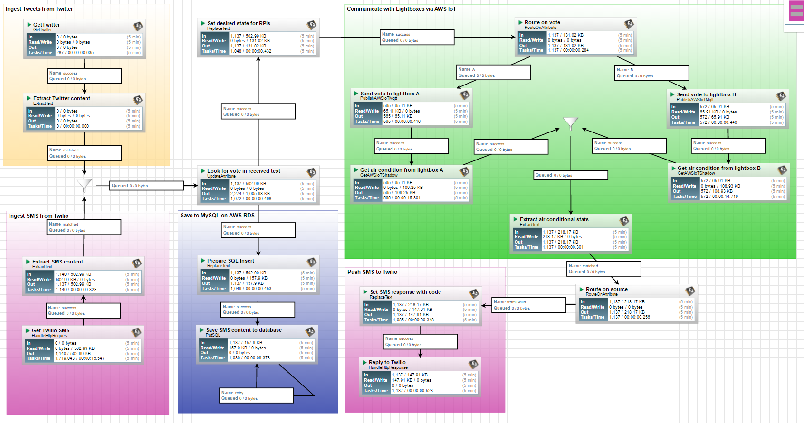
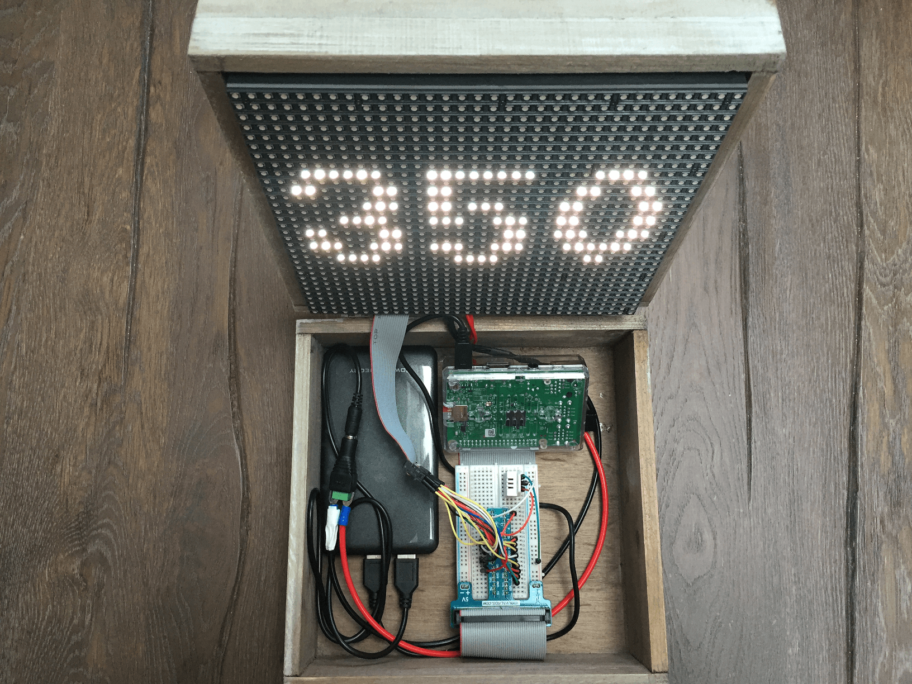
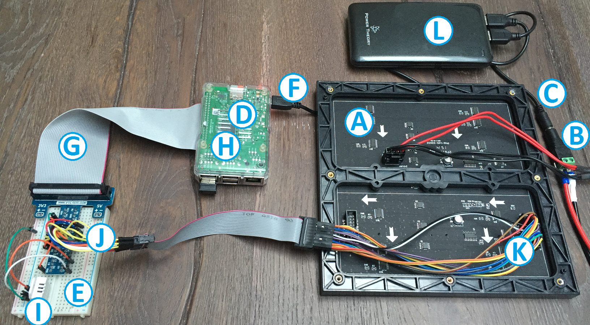
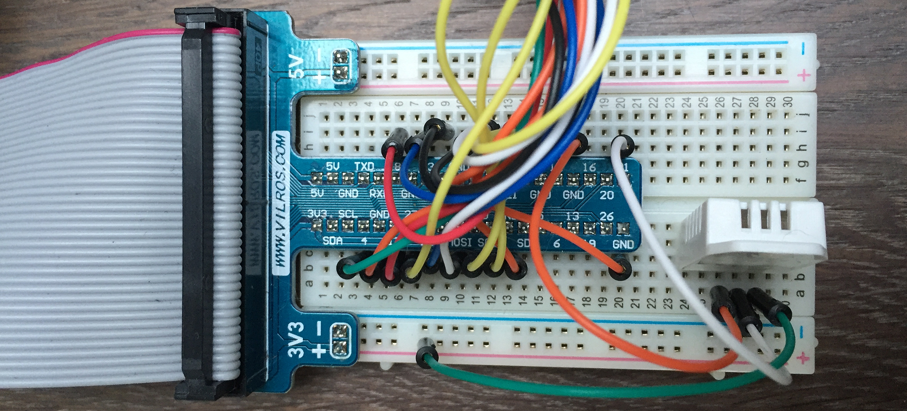

# Sources of Hadoop Summit Cool-Tech Keynote
These sources were used at Hadoop Summit Cool-Tech Keynote.

The demo interacted with the audience by letting them vote on a question with
two possible options (A or B). Each attendee was able to vote by sending out a
text over SMS or Twitter which contained a hashtag according to the vote
(#A or #B). Lightboxes on the stage indicated each incoming vote with flashlights
and returned environmental sensor-data back to phone of the participant.
The overall demo consists of several technical components:
1) Twilio as the SMS provider for sending and receiving SMS to/from the audience.
2) Twitter as another inbound channel for receiving votes from the audience
3) Apache NiFi as the central orchestration tool. The dataflow used for the demo is
introduced below and is available in the Repo as a template (see ./nifi folder)
4) A MySql database to store the votes of all participants
5) Two Lightboxes as IoT edge devices on stage. These boxes are selfmade.
Below you can find the detailed setup of these boxes if you want to
build up your own. The entire software solution to the Lightboxes is provided
in this Git-Repo along with instructions on how to run it on your own box.
6) AWS IoT used as the MQTT broker for communicating with the Lightboxes

# Voting dataflow powered by Apache NiFi
1) Install [Apache NiFi](https://nifi.apache.org/) (e.g. on an EC2 instance of AWS)
It's straightforward.
2) The demos use custom processors for AWSIoT which are currently not part of the
base package. You have to pull my [fork](https://github.com/KayLerch/nifi/tree/nifi-aws-iot-processor)
of NiFi and build and deploy the AWS processor bundle to your NiFi instance.

        cd {nifi-fork-home}/nifi-nar-bundles/nifi-aws-bundle
        mvn -T 2.0C clean install
        cp ./nifi-aws-nar/target/nifi-aws-nar-x.y.z-SNAPSHOT.nar ~/{nifi-home}/lib

3) Go to NiFi's web interface and import the template you can find in __./nifi/__ folder
4) Adjust configuration in the processors as sensitive information is not provided
with the template. Moreover, the linked Controller services needs to be created or
updated with credentials to e.g. AWS.

# Voting database
Set up a MySql instance e.g. on AWS RDS and create this table:

    CREATE TABLE `voting` (
      `participantId` int(11) NOT NULL,
      `senderAlias` text,
      `text` text,
      `votedOnA` bit,
      `votedOnB` bit,
      `votedAt` TIMESTAMP DEFAULT CURRENT_TIMESTAMP
    ) ENGINE=InnoDB DEFAULT CHARSET= latin1;

# Twilio SMS
Once you registered to Twilio and set up a messaging service in "Programmable SMS" add
an HTTP endpoint which points to your NiFi instance. The HTTP processor of this demo's
dataflow listens on port 8081.

# Lightboxes
The edge devices in the voting demo were used to indicate votes of the
audience with flashlights on 32x32 RGB LED Matrix but also to measure
temperature and humidity of the nearby environment to send it back to
the voting attendees. The overall solution consists of two lightboxes where
each of them is dedicated to one of the two options of the voting.

## Physical set-up
If you want to rebuild the demo device you can start with following equipments:

* (A) [32x32 RGB LED Matrix Panel - 6mm pitch](https://www.adafruit.com/products/1484)
* (B) [Female DC Power adapter - 2.1mm jack to screw terminal block](https://www.adafruit.com/products/368)
* (C) [USB to 2.1mm Male Barrel Jack Cable - 22AWG & 1 meter](https://www.adafruit.com/products/2697)
* (D) [Raspberry Pi 3 - Model B - ARMv8 with 1G RAM](https://www.adafruit.com/products/3055)
* (E) [Half-size breadboard](https://www.adafruit.com/products/64)
* (F) [USB cable - 6" A/MicroB](https://www.adafruit.com/products/898)
* (G) [Assembled Pi T-Cobbler Plus - GPIO Breakout - for RasPi A+/B+/Pi 2/Pi 3](https://www.adafruit.com/products/2028)
* (H) [Pi Model B+ / Pi 2 / Pi 3 Case Base - Clear](https://www.adafruit.com/products/2253)
* (I) [DHT22 temperature-humidity sensor](https://www.adafruit.com/product/385)
* (J) [Premium Male/Male Jumper Wires - 20 x 6" (150mm)](https://www.adafruit.com/product/1957)
* (K) [Premium Female/Male Jumper Wires - 40 x 6" (150mm)](https://www.adafruit.com/product/826)
* (L) [Dual USB External Battery, Premium Power Bank High Capacity Most Compact Portable Charger](http://www.amazon.com/HyperGear-16000mAh-External-Capacity-Portable/dp/B0188WLTI8/ref=sr_1_8?ie=UTF8&qid=1464979881&sr=8-8&keywords=powerbank+4.6A) (or similiar)

## Software set-up

Solution is implemented and run with Python. Sources can be found in __./rpi__ folder.

The Python scripts rely on __Python 3.4+__ and meant to run as
daemons on a Pi. Once started they turn the Pi into an IoT
edge computing device. What you need is not only a Pi but
additional periphery connected to it.

Be sure you have the latest __[Raspbian image](https://www.raspbian.org/RaspbianImages)__ on your Pi

Install __Paho MQTT__ for communitcating with AWS IoT over MQTT

    sudo pip3 install paho-mqtt

Install __Adafruit DHT__ libraries to read out temperature and humidity from a DHT22 sensor connected to a GPIO pin of your Pi

    git clone https://github.com/adafruit/Adafruit_Python_DHT.git
    cd Adafruit_Python_DHT
    sudo python3 setup.py install

Install Python libraries to work with __Adafruit's RGB Matrix__ which is also wired to several pins of our Pi.

    git clone https://github.com/hzeller/rpi-rgb-led-matrix.git
    cd rpi-rgb-led-matrix/python
    sudo python3 setup.py build
    sudo python3 setup.py install

You may be faced with an error while building these libraries. See this [Bugfix](https://github.com/Saij/rpi-rgb-led-matrix/commit/d61b537478f418038e9bfdf67ca6932fb0f39fa9) on Github

Now bring the demo code on your Pi
    git clone https://github.com/KayLerch/hadoop-summit-cooltech-voting.git

Go to management console of __AWS IoT__, register a thing and generate __TLS certificates__.
The certificates you are provided with need to be stored in __./cert__ like this:

    ./cert
        ./{thing_name}
            ./certificate.pem.crt
            ./private.pem.key

where *{thing_name}* is the name of your thing as registered in AWS IoT.

## Run
### Temperature
This script acts as an MQTT client. It periodically reads out Adafruit DHT22
temperature sensor for current temperature and humidity and publishs data to
an MQTT topic of your thing in AWS IoT. The dataflow of Apache NiFi will read
from this thing's shadow device and gets the last reported temperature and
humidity without being connected or dependant on the edge devices.

You need to provide at least three parameters

    -t | --thing {thing_name}

where *{thing_name}* is the name of your thing as registered in AWS IoT.

    -p | --pin {pin_no}

where *{pin_no}* is the GPIO pin number the DHT22 sensor is connected to. Default is 21.

    -e | --endpoint {awsiot_endpoint}

where *{awsiot_endpoint}* is the account-specific endpoint to you AWS IoT gateway service.

    -v | --verbose

This will print out runtime information to console. However, you can have a look into __./logs/temperatore.log__
at any time without using verbose argument.

This is an example:

    sudo python3 temperature.py -t myRPi -p 6 -e A1B71MLXKNXXXX.iot.us-east-1.amazonaws.com

### Voting
This script acts as another MQTT client. It subscribes to an MQTT topic of a thing
you registered in AWS IoT. The voting dataflow in Apache NiFi will feed this topic
with the votes coming in as SMS or Tweets to NiFi. Once a vote is received this
script let the RGB matrix flash a light and increment the displayed counter.

You need to provide at least three parameters

    -t | --thing {thing_name}

where *{thing_name}* is the name of your thing as registered in AWS IoT.

    -e | --endpoint {awsiot_endpoint}

where *{awsiot_endpoint}* is the account-specific endpoint to you AWS IoT gateway service.

    -v | --verbose

This will print out runtime information to console. However, you can have a look into __./logs/temperatore.log__
at any time without using verbose argument.

This is an example:

    sudo python3 voting.py -t myRPi -e A1B71MLXKNXXXX.iot.us-east-1.amazonaws.com
